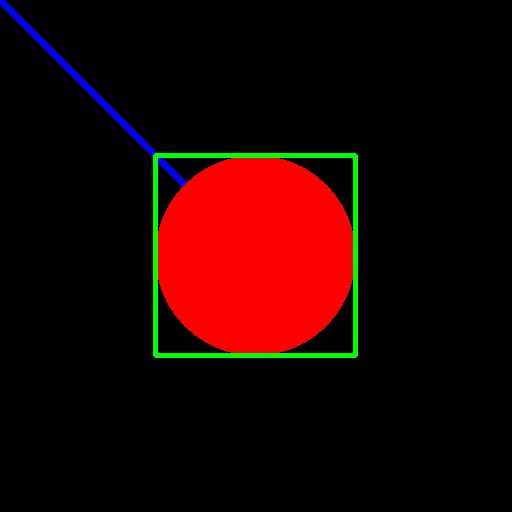

# Drawing Functions

[](./drawingFunctions.jpg)

This project demonstrates the usage of OpenCV's Drawing functions to create an image with various shapes, lines, and texts. The resulting image showcases the versatility and power of OpenCV's drawing capabilities.

## Usage

To run this project, ensure that you have OpenCV installed on your system. If not, follow the installation instructions provided in the main README of this repository.

1. Clone this repository to your local machine using the following command:

   ```bash
   git clone https://github.com/pachecowillians/opencv.git
   ```

2. Navigate to the `drawingFunctions` directory:

   ```bash
   cd opencv/drawingFunctions
   ```

3. Run the `drawingFunctions.py` script:

   ```bash
   python drawingFunctions.py
   ```

   This will generate the image with the drawing functions and save it as `drawingFunctions.jpg`.

4. View the resulting image `drawingFunctions.jpg` to see the output of the drawing functions.

Feel free to modify the `drawingFunctions.py` script and experiment with different shapes, colors, and texts to create your own custom images using OpenCV's powerful drawing functions.