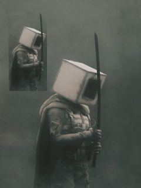

# Image ROI

This project uses OpenCV to define an Region Of Interest (ROI), scale it and insert on original image. The result is shown below. The first image is the original file and the second image is the image with doubled and scaled ROI.

  
  

