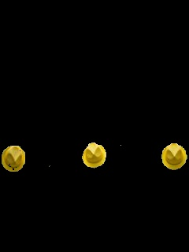

# Object Detection

This project demonstrates the use of OpenCV to detect objects based on their color. Specifically, it focuses on identifying yellow hats. The result of the object detection process is shown below:

Original Image             | Filtered Image (Yellow Hats)
:-------------------------:|:-------------------------:
 | 

## Usage

To run this project, ensure that you have OpenCV installed on your system. If you haven't installed it yet, please refer to the installation instructions provided in the main README of this repository.

1. Clone this repository to your local machine:

   ```bash
   git clone https://github.com/pachecowillians/opencv.git
   ```

2. Navigate to the `imageDetection` directory:

   ```bash
   cd opencv/imageDetection
   ```

3. Run the `object_detection.py` script:

   ```bash
   python object_detection.py
   ```

   This script will process the original image, filter it to identify the yellow hats, and save the resulting image as `hat_edited.jpg`.

4. View the resulting images:

   - `hat.jpg` is the original image.
   - `hat_edited.jpg` is the filtered image where the yellow hats are identified.

Feel free to modify the `object_detection.py` script and experiment with different color ranges or other objects to detect. OpenCV provides various tools and techniques that can be explored further for object detection and recognition tasks.