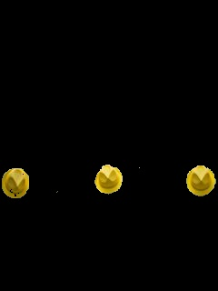

# Object Identifying

This project uses OpenCV to detect an object by its color. In this case, the identified objects are the yellow hats. The result is presented below. The first image is the original file and the second image is the filtered image to identify the yellow hats.

   &nbsp;
  

