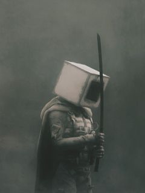
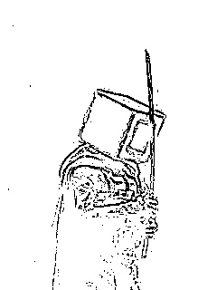

# Tresholding

This project uses OpenCV to mark the edges of the image. The result is shown below. The first image is the original file and the second image is the outlines of the original image.

   &nbsp;
  

